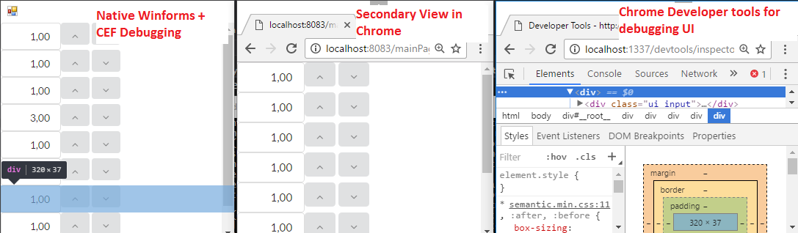

# Fablish
This library provides utilities for building Elm style [[1]] applications in .NET.
In contrast to fable [[2]], which uses a F# to JS compiler, this library runs directly in your favorite CLR. 
However, in order to stay somewhat compatible we reused fable-archs API but replaced the virtualdom backend
for technickal reasons with a custom codegenerator which creates the HTML dom via react [[3]].

The overall architecture is as such:
 - elm architecture similar to fable-arch [[8]]
 - fable style API for building views
 - javascript code generator for building React DOM
 - websocket via suave [[7]] provides dom to static webpage
 - the webpage utilizes websocket and react to update and render the DOM
 - the overall application can be hosted in the browser alone or by using the battery included chromium window.

## When to use

fablish is useful if your use case looks like:
 - you want purely functional user interfaces
 - you want to profit from web technology and tooling
 - you want solid technology for rendering your ui (browsers are superfast ;)
 - you still want native .net programs since your application state cannot be run in the broser alone (e.g. you are rendering several GB of data?)

## Write Elm Style Application using similar API to fable:

```F#
module TestApp =

    type Model = int

    type Action = Inc | Dec

    let update (m : Model) (a : Action) =
        match a with
            | Inc -> m + 1
            | Dec -> m - 1

    let view (m : Model) : DomNode<Action> =
        div [] [
            text (sprintf "current content: %d" m)
            br []
            button [onMouseClick (fun _ -> Inc)] [text "increment"]
            button [onMouseClick (fun _ -> Dec)] [text "decrement"]
        ]

    let app =
        {
            initial = 0
            update = update 
            view = view
            onRendered = Script.ignore
        }

```

## Since by default we use chromium for rendering UIs, initialize chromium:
```F#
ChromiumUtilities.unpackCef() // downloads CEF build if not already present
Chromium.init argv            // initialized CEF runtime
```

## Run your app

Either use application setup to spawn a win forms window with embedded chrome and your UI:
```F#
let browser = Chromium.runControl "8083" app
use w = new Form()
w.Controls.Add browser
w.Width <- 800
w.Height <- 600
Application.Run(w) 
```

or use a standalone server:
```F#
Fablish.runLocally "8083" app
```

In both cases your application can be debugged using chrome debugging tools:

## Building

- run ``build.cmd`` or ``build.sh`` (F# 4.0 [[9]] and .net or mono needs to be installed)
- you can also use the prebuilt package currently available here: https://vrvis.myget.org/feed/aardvark_public/package/nuget/Fablish

## Debugging
https://github.com/vrvis/fablish/blob/master/docs/teaser.png


## Interactive Development

fablish-hmr [[4]] provides webpack [[5]] style interactive programming by utilizing F# compiler services. A video shows off this feature: [youtube video on hmr](https://www.youtube.com/watch?v=if5Natbyx0s&feature=youtu.be)

## How to contribute 

Note that this project is in very early stage of development. Still, help in building rich user interface libraries
is welcome ;)

 [1]: https://guide.elm-lang.org/architecture/
 
 [2]: http://fable.io/fable-arch/
 
 [3]: https://facebook.github.io/react/
 
 [4]: https://github.com/vrvis/fablish/tree/master/src/fablish-hmr
 
 [5]: https://webpack.github.io/

 [6]: https://www.youtube.com/watch?v=if5Natbyx0s&feature=youtu.be

 [7]: https://suave.io/

 [8]: http://fable.io/fable-arch/
 
 [9]: https://www.microsoft.com/en-us/download/details.aspx?id=48179
